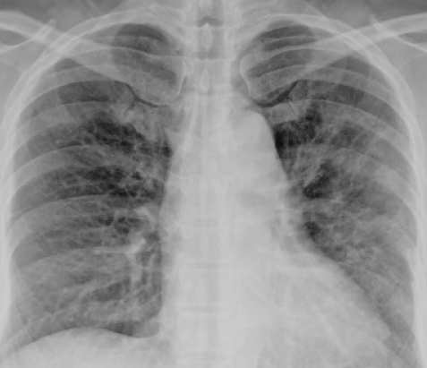

# Chest X-Ray Abnormality Detection Project

This repository contains the code, documentation, and resources for a project focused on the detection of abnormalities in chest X-ray images using deep learning techniques. The project leverages state-of-the-art convolutional neural networks (CNNs) and transfer learning to assist in the diagnosis of diseases such as pneumonia and COVID-19 from radiographic images.

## Project Overview
- **Goal:** Develop and evaluate a computer-aided detection system for chest X-rays, aiming to support radiologists in identifying thoracic diseases.
- **Techniques:** Utilizes deep learning, specifically CNNs, for image classification and abnormality localization.
- **Datasets:** References to large-scale chest X-ray datasets and benchmark studies are included in the `papers/` directory.
- **Documentation:** The `editable_source/` folder contains editable DOCX versions of the main report and configuration manual.

## Repository Structure
- `adok18191592.pdf` — Main project report (PDF)
- `Configuration Manual x18191592.pdf` — Configuration and setup manual (PDF)
- `editable_source/` — Editable DOCX sources for the report and manual
- `papers/` — Collection of referenced research papers
- `link.txt` — Links to demonstration videos (YouTube and Google Drive)
- `x18191592_feedbackQA.docx`, `x18191592_viva_response.pdf`, `Final Feedback from Examiner.pdf` — Feedback and responses

## Demo Video
A demonstration video of the system is available:
- [YouTube Link](https://youtu.be/50Unyr6FFrM)
- [Google Drive Link](https://drive.google.com/file/d/1dsu_PTH38uPOWmWdv-1cd7ORpFk15s1T/view?usp=sharing)

## Example Images
Below are example images to illustrate the system's functionality. Replace these placeholders with actual output or system screenshots as needed.


*Sample input X-ray image.*


*Example of model prediction and abnormality localization.*

## Getting Started
1. **Clone the repository:**
   ```bash
   git clone <repo-url>
   ```
2. **Review the configuration manual** in `Configuration Manual x18191592.pdf` for setup instructions.
3. **Refer to the main report** in `adok18191592.pdf` for methodology, results, and discussion.

## References
A curated list of research papers relevant to chest X-ray analysis and deep learning is provided in the `papers/` directory.

## Feedback
See `Final Feedback from Examiner.pdf` and `x18191592_feedbackQA.docx` for examiner feedback and responses.

---

*For more details, consult the full report and configuration manual. For questions, please refer to the contact information in the documentation.*
